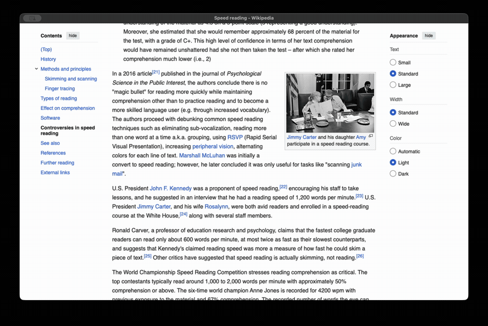
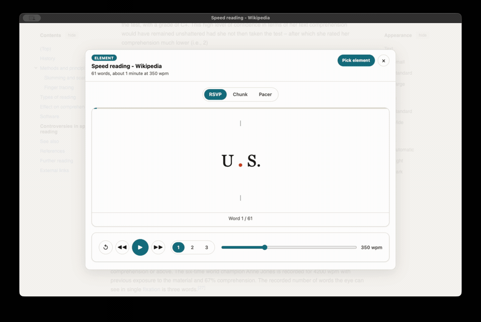
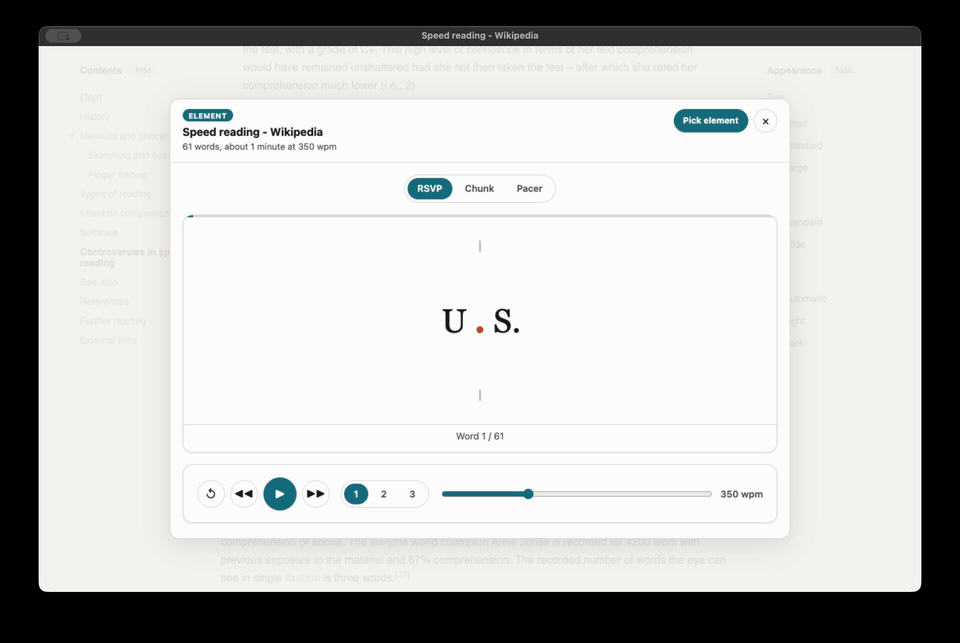

# Speed Reader

A self-contained speed reader available as both a standalone page and a
Chrome extension. Both surfaces share the same reader implementation. There are
no runtime dependencies, external requests, accounts, or analytics.

## Install the Chrome extension

One line (macOS or Linux):

```
curl -fsSL https://github.com/sblattj/speed-reader/releases/latest/download/install.sh | bash
```

The script downloads the latest release into `~/.speed-reader/extension`, copies
that path to your clipboard, and opens `chrome://extensions`. Then:

1. Turn on **Developer mode** (top right).
2. Click **Load unpacked** and paste the path (Cmd+Shift+G in the macOS file
   picker).
3. Pin Speed Reader and press Alt+R on any page.

To update, rerun the same line and click the reload icon on the Speed Reader
card. The folder stays put, so your settings carry over.

Manual install: download `speed-reader-extension.zip` from the
[latest release](https://github.com/sblattj/speed-reader/releases/latest),
unzip it, and **Load unpacked** the unzipped folder. Works in Chrome, Arc,
Brave, and Edge.

## Or just open the page

Download `speed-reader.html` from the
[latest release](https://github.com/sblattj/speed-reader/releases/latest) and
open it in any browser. It works straight from `file://`, no server needed.

## Build from source

```
git clone https://github.com/sblattj/speed-reader.git
cd speed-reader
bun run build     # writes index.html and dist/ (load dist/ unpacked)
bun test
bun run package   # also zips release assets into release/
```

To cut a release, bump `version` in `extension/manifest.json`, then push a
matching tag (`git tag v1.2.0 && git push origin v1.2.0`). The release workflow
builds, tests, and publishes the zip, page, and installer.

## Using the extension

Extension gestures:

- Click the toolbar button or press Alt+R to read the page.
- Press Alt+Shift+R or choose **Speed read selection** from the context menu to
  read selected text.
- Choose **Speed read an element** from the page context menu to enter element
  pick mode directly.
- Choose **Pick element** in the reader header to hide the reader and select one
  element from the live page.
- In pick mode, move the pointer to highlight an element, scroll as needed, click
  to read only that element and its descendants, or press Esc to cancel.

Chrome internal pages, the Chrome Web Store, and the built-in PDF viewer do not
permit script injection. The extension shows a brief red `!` badge when invoked
on one of those pages.

### Pick exactly what you want to read

Open the reader, choose **Pick element**, and click any paragraph, section,
comment, or other live-page element. The reader reopens with only that element
and its descendants.



## The three modes

**RSVP (flash mode).** Words flash one chunk at a time at a fixed spot in the
middle of the stage. At chunk size 1, the chunk's optimal recognition letter is
highlighted in orange and held at a fixed horizontal position (Spritz style), so
your eyes never have to hunt for the next word. Chunk sizes 2 and 3 just center
the group of words.



**Chunk (phrase mode).** A midpoint between RSVP and Pacer. One phrase of
roughly 3 to 5 words flashes at a time, split at natural clause boundaries
instead of a fixed word count: it never crosses a sentence or paragraph break,
and it prefers to end a phrase right after a comma, semicolon, or colon once
the phrase already has a couple of words in it. Honestly, this restores some
of the small within phrase eye movement that RSVP removes, but like RSVP it
still hides the rest of the text, so backward glances and preview stay
limited compared to Pacer.


**Pacer (guided highlight).** The full text stays on screen as normal
paragraphs, and a highlight sweeps through it at your chosen pace, auto
scrolling to keep the highlight roughly in the middle of the view. You can
click any word to jump there. This mode keeps the whole text visible, which
matters, see the note on the science below.



The chunk size buttons (1, 2, 3) only apply to RSVP and Pacer. In Chunk mode
they are disabled and replaced with a small note, since phrase length there
is decided by the text itself, not by a fixed count.

Switching between modes keeps your place in the text.

## Controls

- Play or pause, restart, back one sentence, forward one sentence
- Chunk size: 1, 2, or 3 words
- Words per minute slider, 100 to 900
- A short 3, 2, 1 countdown before playback starts or resumes, so your eyes
  can settle before the words start moving
- A session summary when you finish a pass: total words, reading time, and
  effective words per minute, plus a prompt to say out loud what the text
  argued before you decide to speed up

## Keyboard shortcuts

- Space: play or pause
- Left arrow: back one sentence
- Right arrow: forward one sentence
- Up or down arrow: words per minute, plus or minus 25
- R: restart

Shortcuts are ignored while you are typing in the text box.

## Your text

The text box under the stage holds whatever you want to read. Word count
updates live. Press Load text to load it into the reader. Clearing the box and
loading again falls back to the built in sample text. Your reading text is
never saved, only your speed, chunk size, mode, and theme preferences persist
between visits.

## What the science actually says about RSVP

Skilled adult readers already move through text at roughly 200 to 400 words
per minute, and that ceiling comes mostly from how the brain processes
language, not from how fast the eyes can physically move. Normal reading also
is not one smooth pass forward: about 10 to 15 percent of eye movements are
regressions, short backward glances that resolve confusion, and readers
constantly preview upcoming words with their peripheral vision. Flashing one
word at a time removes both of those tools at once. Research backs up the
cost: Schotter, Tran, and Rayner (2012) found that blocking those backward
glances hurt comprehension, and Benedetto and colleagues (2015) found that
Spritz style flashing held up on surface level understanding at moderate
speeds but increased eye strain and hurt deeper comprehension. A widely cited
2016 review by Rayner and colleagues summed it up as no free lunch: push speed
past your natural rate and comprehension pays for it. The honest way to read
faster is slower to sell: practice a little above your comfortable pace,
build vocabulary and background knowledge, and use deliberate skimming when
gist is enough. That is why this app also ships a pacer mode that keeps the
whole text visible while still pushing your pace.
